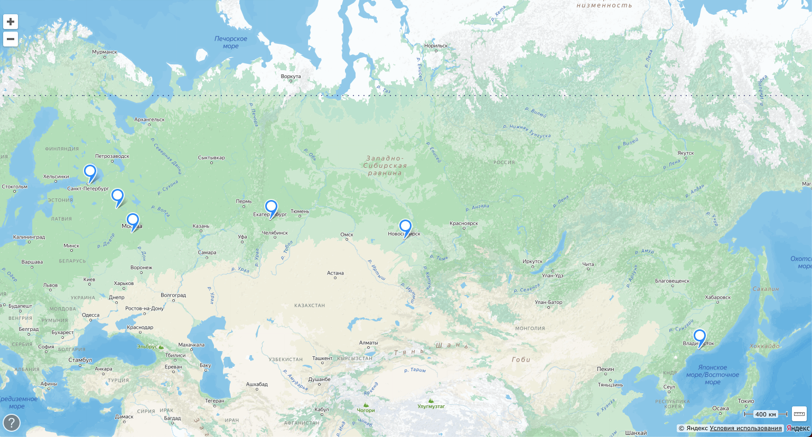
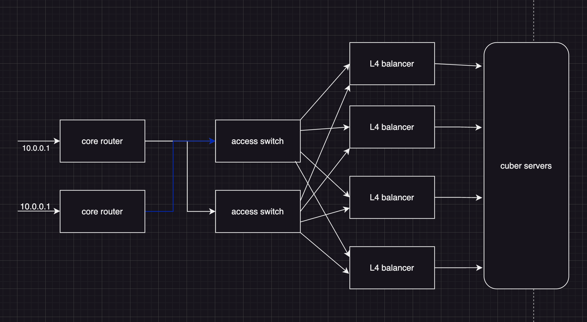
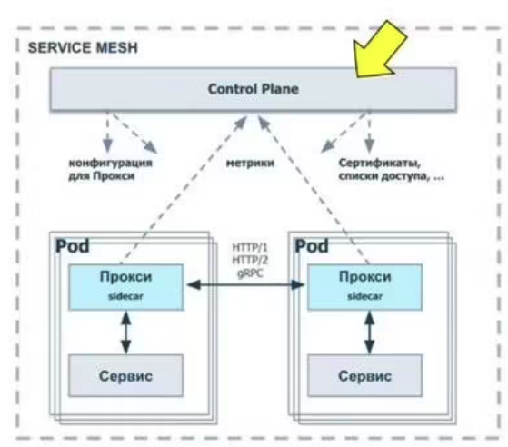
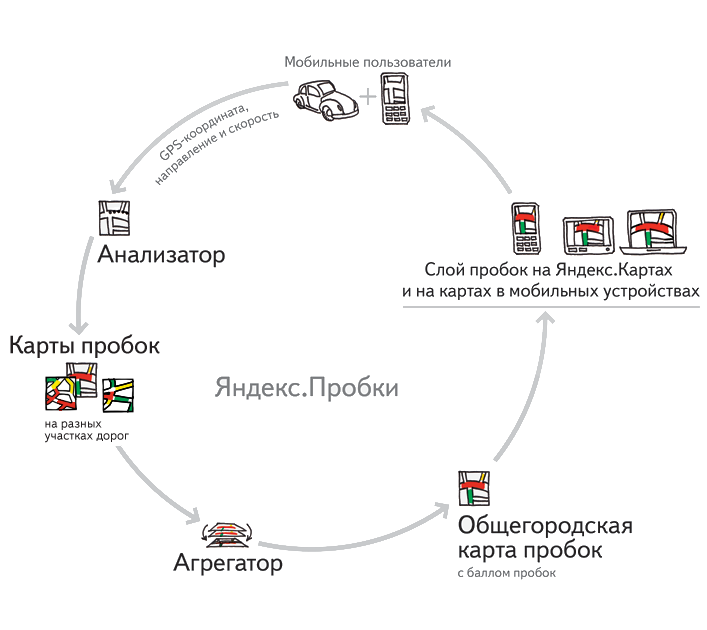

# Репозиторий с проектированием курсовой работы по хайлоаду на тему Яндекс.Карты

## Содержание

- [Репозиторий с проектированием курсовой работы по хайлоаду на тему Яндекс.Карты.](#репозиторий-с-проектированием-курсовой-работы-по-хайлоаду-на-тему-яндекскарты)
  - [Содержание](#содержание)
  - [1. Тема и целевая аудитория](#1-тема-и-целевая-аудитория)
    - [1.1 Тема](#11-тема)
    - [1.2 Целевая аудитория](#12-целевая-аудитория)
    - [1.3 MVP](#13-mvp)
  - [2. Нагрузка](#2-нагрузка)
    - [2.1 Продуктовые метрики](#21-продуктовые-метрики)
    - [2.2 Технические метрики](#22-технические-метрики)
  - [3. Глобальная балансировка](#3-глобальная-балансировка)
  - [4. Локальная балансировка](#4-локальная-балансировка)
  - [5. Логическая база](#5-логическая-база)
  - [6. Физическая база](#6-физическая-база)
  - [7. Алгоритмы](#7-алгоритмы)
  - [Список использованной литературы](#список-использованной-литературы)

## 1. Тема и целевая аудитория

### 1.1 Тема

  Яндекс Карты — поисково-информационная картографическая (ведущее геонавигационное
приложение в России)[^2] система. Есть поиск по карте, информация о пробках, отслеживание городского транспорта, прокладка маршрутов и панорамы улиц крупных и других городов.

Категория - онлайн-карты.

### 1.2 Целевая аудитория

***MAU*** = 50 млн по России.
Клиентами являютcя практически все возрастные слои населения, начиная от школьного возраста, заканчивая современными пенсионерами.

### 1.3 MVP

Основными задачами карт являются[^3]:

1. Отображение карты.
2. Поиск отпределëнных адресов.
3. Поиск групп адресов по тегам (например, "аптека").
4. Построение маршрута с учëтом препятствий, дорог, пробок.
5. Расчёт времени, которое займёт маршрут.

## 2. Нагрузка

### 2.1 Продуктовые метрики

***MAU*** = 50 млн по России.
***DAU*** = 8 млн по России.

На одного пользователя:
Из пользовательских данных обычно:

- аватарка,
- адрес дома и адрес работы (избранные места),
- история поиска по картам, а также построенные маршруты,

Максимум позволяются `1000` адресов в избранном у одного пользователя, в среднем это 2-3 адреса.
В картах хранится история поиска за последние 90 дней. В среднем 2 маршрута и 10 поисковых запросах на пользователя.
Данные взяты из опроса 3 друзей и собственного опыта.

На аватарку `2 Мб`.

Средняя длина поискового запроса на компьютерах — чуть больше четырёх слов, на планшетах — 3,9, на телефонах — уже 3,6[^9]. То есть 4 слова, при средней длине слова 5 символов выходит хранение 5 * 4 байт = 20 байт на запрос, а всего `200 байт`.

Если предположить, что адресная запись содержит основные поля, такие как улица, город, почтовый индекс и страна, а также дополнительные поля, такие как номер дома, номер квартиры и т.д., то средний размер одного адреса может составлять примерно от 100 до 500 байт. Возьмем грубо `300 байт`. Итого на адреса пользователя `600 байт`.

**Среднее количество действий пользователя по типам в день:**

Пользователь запрашивает отображение карты (тайлы), в среднем за одну прогрузку это 36 запросов на получение png картинки. За день допустим это происходит 3 раза на пользователя. Учитывая, что ещё нужно получить сами данные в json (тоже 3 раза за день), а также то, что пользователь нажимает по точкам на карте по 3 раза за сессию. Пользователь строит маршрут, уточняя информацию по точке назначения и путь. Выходит на пользователя:

По результатам опроса 3 друзей.

36 * 3 = `108 запросов` за тайлами в день, `3 запроса` за метками с карты и `2 запроса` (по опыту работы с сервисом яндекс карты, с консоли разработчика) на построение маршрута.

|Продуктовая метрика| Средний размер|
|--|--|
| MAU | `50 млн.` |
| DAU | `8 млн.` |
| Среднее хранилище пользователя | `2 Мб 800 байт` |
| Среднее количество действий пользователя по типам в день | `108 запросов - тайлы, 3 запроса - метки с карты, 2 запроса - построение маршрута` |

### 2.2 Технические метрики

### Хранилища

Пользовательские данные можем посчитать, взяв данные одного пользователя выше и MAU:

    2 Мб 800 байт * 50 000 000 = 95 Тб

Хранимые данные:

- Метки на карте
- Тайлы генятся с апишки внешней и уточняются сервисом, кешируются
- Дорожный граф
- Кеши маршрутов и поиска
  
Используем тайлогенератор OpenStreetMap, города занимают 1-3 процента земного шара, то есть рассчитываем карты и храним, нужно часто прогревать.
Площадь земной поверхности 510 млн кв.км., значит площадь городов до `15.3 млн кв.км.`. При этом коэффициент отношения площади городов к общей поверхности = `0.03`
Остальную область запрашивают значительно реже, при этом точность там тоже не нужна, в рассчёт не берем.

Один тайл представляет собой png размером 256х256px,
В среднем, PNG-изображение с 256x256 пикселей и цветовой глубиной 24 бита (без прозрачности) может занимать примерно `192 килобайта` (KB). Из структуры растровых тайлов[^10][^6] можно понять, что зависит количество тайлов от зума. Максимальный в рамках часто используемых зум = 16, а минимальный = 10 (выяснил опытным путем по картам), итого 4^16 + 4^15 + ... 4^10 = `5 726 273 536 тайлов`, итого мы храним с учетом коэффициента:

    Тайлы (шт): 0.03 * 5726273536 = 171 788 206 штук
    Тайлы: 192 KB * 171 788 206 * 0.03 = 30.7 Тб

Для геокодинга используем базу адресов, пишем на её основе своё решение для России. Можно использовать PostGis.
Протяженность автомобильных дорог с твердым покрытием в России - `984 тыс. км`. На всю Россию получается примерно 14.5 миллионов рёбер[^5]. На ребре нужна средняя скорость, а также текущее состояние - настоящая средняя скорость (учитывая пробки), длина сегмента, прочие данные. Всего 1 ребро займет не больше `1 Кбайта`.

    Дорожный граф: 14 500 000 * 1 Кбайт = 13.8 Гб

Маршруты без учёты пробок строятся и хранятся построенными в системе[^7]. Один маршрут весит `0.2-2 Мбайт` (подсчитанно практически), итого по DAU и условии, что в среднем за месячный кеш на пользователя приходится по 2 маршрута в день. Посчитаем место под маршруты.

    Маршруты: 2 * 2 Мб * 8 млн * 30 дн = 914 Тб

Метка в картах занимает около `50 Кбайт` (померил с помощью софта по json и апи карт яндекса). Всего юр лиц в стране 3.31 млн[^11], физических точек минимум в 10 раз больше. Имеем:

    Метки: 50 Кбайт * 3 310 000 * 10 = 1.58 Тб

### RPS

- Запрос за пользовательскими данными
- Получение тайлов (именно картинок при рисовке карты)
- Инфа про метки на тайле приходит с одним запросом данных на карту
- Уточнения по карте (поиск)
- Запрос за пробками и дорожными событиями (одна ручка на объект)
- Нагрузка на внешние сервисы апи (OpenStreetMap)

Пользователь запрашивает аватарку, свои маршруты и 10 поисковых запросов по 2 раза в день (при условии, что эти данные не кешируется между 2 сессиями пользователя, когда он заходит для построения маршрута).

    (2 * 3 запроса * 8 000 000) / (24 * 60 * 60) = 556 запросов / сек

Один пользователь за день запрашивает из рассчётов выше `108 тайлов`, с ними 3 запроса за информацией по карте.

    (111 * 8 000 000) / (24 * 60 * 60) = 10 277 запросов / сек

Запросы поиска (и любой геокодинг) - это 5-10 раз за день использования:

    (10 * 8 000 000) / (24 * 60 * 60) = 926 запросов / сек

Запрос за пробками и дорожными событиями каждые 30 сек, если взять час отслеживания в день:

    (120 * 8 000 000) / (24 * 60 * 60) = 11 111 запросов / сек

Раз в 30 секунд при подключенных пробках и/или событиях на дорогах идёт сбор показателей и обновление с небольшой задержкой.
Трекинг GPS тратит `175 байт` трафика за одну отправку данных[^12]. По информации ChatGPT в час вебсокет на поддержание соединения тратит `1200 байт`, в секунду `0.3 байта` . Тогда из рассчёта, что на пользователя используется вебсокет и при этом постоянная отправка gps трекера при использовании, получим на одного человека в сутки примерно на средний маршрут в 1 час, а это раз в 10 секунд трекинг - 60 * 60 / 10 = `360 запросов в сутки`.

Запросы на построение маршрута - это 1-2 маршрута в день на пользователя (при роутинге х10 минимум), перестройка маршрута с учётом событий на дорогах могут дать оверхед в передаче с сервера других маршрутов через вебсокет, то есть считаем, что tcp соединение идёт в течение часа в день на пользователя:

    Роутинг маршрута: ((360 / 24 + 1) 8 000 000) / (60 * 60) = 35 555 запроса (считая 2222 соеднинения по вебсокету) / сек
    Построение маршрута: 2 * 10 * 8 000 000 / (24 * 60 * 60) = 1 852 запроса / сек

**Пиковый RPS и трафик считаем в 2 раза больше дефолтного.**

| Тип запроса | Данные пользователя | Роутинг маршрута | Построение маршрута | Тайлы | Поиск | Пробки и дорожные события | Общий rps (MAX) |
|--|--|--|--|--|--|--|--|
| Cредний | 556 rps  | 35 555 rps| 1 852 rps | 10 277 rps | 926 rps | 11 111 rps | 60 277 rps |
| Пиковый | 1 112 rps | 71 110 rps | 3 704 rps | 20 554 rps | 1 852 rps | 22 222 rps | 120 554 rps |

`Пользователей с запросами за своими данными в ДЦО в Мск по отдельному домену`, чтобы не городить тяжелой логики с распространением контента данного вида, при этом rps там низкий.

### Сетевой трафик

Пользовательские данные:

    Трафик: 16 Мбит * 556 запросов / сек = 8.7 Гбит/сек
    Пиковое потребление: 15.4 Гбит/сек
    Суточный: 93 960 Гб/сут

Роутинг маршрута:

    Трафик: ((175 байт * 360 * 8 000 000) / (24 * 60 * 60) + 20 байт * 2222 соединения) * 8 = 5.6 Мбит/сек
    Пиковое потребление: 11.2 Мбит/сек
    Суточный: (175 байт * 360 + 1200 байт) * 8 000 000 = 1375 байт * 8 000 000 = 477 Гб/сут

Построение маршрута:

    Трафик: 16 Мбит * 1852 запросов / сек = 29 Гбит/сек
    Пиковое потребление: 58 Гбит/сек
    Суточный: 313 200 Гб/сут

Тайлы:

    Трафик: 1536 Кбит * 10277 запросов / сек = 15 Гбит/сек
    Пиковое потребление: 30 Гбит/сек
    Суточный: 162 000 Гб/сут

Поиск:

    Трафик: 400 Кбит * 926 запросов / сек = 361 Мбит/сек
    Пиковое потребление: 722 Мбит/сек
    Суточный: 3 807 Гб/сут

Всего в Москве (крупнейший город в России) 5 000 улиц[^13], при этом взяв, что сегментов дорог 25 000, получим, что один пользователь будет запрашивать 1/100 часть равную около `2500 сегментов` весом по 1 Кб каждый, итого `2.4 Мб` на один запрос.

Пробки и дорожные события:

    Трафик: 2.4 Мб * 11111 запросов / сек = 26.5 Гбит/сек
    Пиковое потребление: 53 Гбит/сек
    Суточный: 262 200 Гб/сут

| Тип запроса | Пользовательские данные | Роутинг маршрута | Построение маршрута | Тайлы | Поиск | Пробки и дорожные события | Общий rps (MAX) |
|--|--|--|--|--|--|--|--|
| Cредний | 8.7 Гбит/сек | 5.6 Мбит/сек | 29 Гбит/сек | 15 Гбит/сек | 361 Мбит/сек | 26.5 Гбит/сек | 85.1 Гбит/сек |
| Пиковый | 15.4 Гбит/сек | 11.2 Мбит/сек | 58 Гбит/сек | 30 Гбит/сек | 722 Мбит/сек | 53 Гбит/сек | 170.2 Гбит/сек |

## 3. Глобальная балансировка

### Расположение ДЦ

Аудитория проекта - граждане РФ, следовательно расположим ЦОДы в горячих точках страны. Чтобы покрыть всю страну, при этом учитывая плотность населения по субъектам[^15], выберем следующие точки:

| Расположение по городам |
|--|
| Москва |
| Удомля |
| Санкт-Петербуг |
| Екатеринбург |
| Новосибирск |
| Владивосток |

### Расчет распределение запросов

Локально запросы делятся на 5 зон (все ДЦ, кроме Удомли, он резервный для Москва-СПБ). Пиковый общий RPS (на балансеры) у нас - `120 554 rps`. Из той же плотности населения[^15][^19] выясним проценты пользователей по точкам, притом считаем, что в Мск ходит Центральный, Южный и Северо-Кавказский округи и Северо-Западный на СПБ, а прочие распределенно в Екатеринбург, Новосибирск и Владивосток.

    Москва: 42.4% * 120 554 = 51 235 rps.
    СПБ: 10.6% * 120 554 = 12 779 rps.

Около 14 процентов на Сибирь (Новосибирск) и 11 процентов на зону ЕКБ (Приволжский + Уральский округи), а также 5 процентов на дальний восток:

    Екатеринбург: 28% * 120 554 = 33 755 rps.
    Новосибирск: 14% * 120 554 = 16 878 rps.
    Владивосток: 5% * 120 554 = 6 028 rps.

| ДЦО | RPS |
|--|--|
| Москва | 51 235 |
| Санкт-Петербуг | 12 779 |
| Екатеринбург | 33 755 |
| Новосибирск | 16 878 |
| Владивосток | 6 028 |

**Поправка:** -556 rps на пользовательскую инфу всем ЦОДам, кроме Москвы, так как данеык хранятся в Московском ДЦ.

## Балансировка нагрузки

Используем собственную автономную сеть с маской /24, тогда мы сможем настроить `BGP Anycast`. По факту посылаем на один общий (anycast) для всех физических ЦОДов ip, как 8.8.8.8 гугла.

`BGP` - динамический протокол маршрутизации преимущественно глобальной сети Интернета. Для нас важно правильно настроить точки присутствия и внутренне сконфигурировать hopы для лучшего определения нужного ЦОДа для конкретного клиента. На наши 6 дата центров нам придётся анонсить соотвественно `6 AN` с anycast, тогда по глобальной таблице маршрутизации выйдет зарезолвить нашу сетевую систему и направить пользователя по правильному пути.

Исходя из [^16] и [^17] можно сделать вывод, что у BGP есть две важных проблемы, которые нужно решить, а именно это:

- Невозможность определить реальную нагруженность приёма ДЦ в реальный момент врмемени, а также дешевый маршрут не всегда надежный;
- Крупные операторы (TIER1) имеют множество точек присутствия, то есть может быть кейс подключения через Америку вместо местного оператора из-за меньших хопов, а так как мы по-любому будем подключаться к таким операторам, нужно придумать, как конфигурировать BGP.

Первая проблема сложно решаема, так как какой-нибудь latency-based DNS бы помог, но его по сути нужно реализовывать самим, так как мы не подключены к облачным сервисам. Вторая проблема решается[^18] фальшивыми hop'ами в виде дополнительных роутеров на таких операторов, что повышает кол-во точек отказа, но помогает конфигурировать bgp. Для смягчения обеих проблем мы сделаем свой софт, который будет считать путь до серверов исходя из глобальной ситуации, а также прочих метрик-состояний нашего сервиса (такие, как неправильные хопы, нагрузка на текущих ЦОДах, особенности ландшафта и расположения реальных магистралей по пути следования). В итоге `используя такую программу` на клиенте или DNS, получим лучший результат.

У нас полноценный CDN для статики (по сути всех расмотренных в пункте 2 данных), а также кеширования. Помимо реализуем `fallback на GEOIP DNS`.

## 4. Локальная балансировка

Virtual Server via Direct Routing (L4) + L7 на nginx;

### Входная схема балансировки

Первый контур чисто на сетевом оборудовании, для отказоустойчивости. Далее условно к каждому физическому серверу, проксирующему Apps, мы подключаемся через балансеры, при этом трафик с сети распределяется на несколько балансеров. Используем VSviaDR, чтобы не упереться по выходному трафику в балансер L4.

### Схема отказоучстойчивости и L7 балансировки

Структура Service Mesh'а:

На картинке структура стандартного Service Mesh в кубере[^14], Control Plane (тот же Service Discovery) отвечает за назначение и распространение политик маршрутизации трафика, артефакты, безопасность, токены, ключи, сертификаты. А еще за сбор телеметрии и интеграцию с внешней инфраструктурой. Чаще всего это PKI, журналирование, мониторинг и т. д.

Sidecar Proxy (Data Plane) размещается непосредственно с приложениями и занимается очень простым делом: исполняет политики, которые получает от Control Plane. Соответственно, Data Plane — это чаще всего сетевые прокси, которые отвечают за маршрутизацию и балансировку трафика в нагруженной среде. Также Data Plane выполняет аутентификацию, авторизацию всех вызовов, формирует спаны для распределенной трассировки и метрики для того, чтобы повысить уровень обозреваемости микросервисных систем.

За `sidecar proxy` берем `nginx`. Это L7 балансер, который поддерживает очень много фич. На нём же у нас происходит `терминация SSL`, при этом будем пользовать Session cache. Тянет он около 96 000 коннектов[^20].

Так как у нас геопозиционный сервис, который отправляет трекинг шорт поллингом и может быть необходимость включать вебсокеты, то будем использовать Redirect Based Load Balancing. Сценарий: пользователь начал пользоваться навигационными фичами, тогда мы в локальном слое балансировки посылаем его на `точно` ближайший и/или `наименее нагруженный` сервер для дальнейшей продолжительной работы.

## 5. Логическая база

Таблички для кешей и базы тайлов, маршрутов, дорожного графа, меток (их детальной инфы). Структуры для агрегации данных в кликхаусе.

## 6. Физическая база

Реляционная база - Postgres.

MemCacheD - простой сценарий кеширования, можно использовать memchache базу (redis...), но нужен алгос вытеснения данных (LRU не всегда помогает). Юзаем например тарантул.

Агрегация событий на дороге, а также трекинг GPS через clickhouse.

ДВХ на s3 для тайлов.

## 7. Алгоритмы

Для построения маршрутов[^1] мы используем алгоритм A*, это тот же алгоритм Дейкстры, но при этом он использует эвристику, то есть использует некие параметры для предположения о дальнейшем пути. Почти все маршруты рассчитываются заранее.

Прямое и обратное геокодирование реализуется решением на постгресе (PostGis)[^5], если не устроит, то пишем своё решение для решения проблемы дубликатов адресов.

Алгоритм роутинга будет работать на постоянном трекинге (обращения пользователя в анализатор положения), далее идёт отслеживание по карте по алгоритму[^22].

Алгоритм дорожных пробок работает посредством специального аналитического алгоритма[^21].

## Список использованной литературы

[^1]: [Маршрутизация в приложении](https://yandex.ru/company/technologies/routes/)
[^5]: [Маршрутизация в опенсорс решении](https://habr.com/ru/companies/vk/articles/262185/)
[^2]: [Отчёт за квартал 2023 года Яндекс](https://yastatic.net/s3/ir-docs/events/2023/IR_2Q2023_RUS.pdf)
[^3]: [Информация по рекламе сервиса Яндекс.Карты](https://skillbox.ru/media/marketing/rukovodstvo-po-reklame-na-yandeks-kartakh-kak-ona-rabotaet-skolko-stoit-i-kak-nastroit/)
[^4]: [Старая информация по аудитории Яндекс.Карты](https://www.seonews.ru/analytics/kak-ne-zabluditsya-v-yandeks-kartakh-issledovanie-auditorii-keys/)
[^5]: [PostGis и дорожный граф реализация] (https://h.amazingsoftworks.com/en/articles/688556/)
[^6]: [Апи тайлов] (https://yandex.ru/dev/tiles/doc/ru/)
[^7]: [Хранение данных карт] (https://vashmirpc.ru/gde-xranyatsya-karty-yandeks-navigatora/)
[^8]: (https://www.burn-soft.ru/na-chem-osnovany-yandeks-karty-tehnologii-i-dannye/)
[^9]: (https://yandex.ru/company/researches/2016/ya_search_2016#kolichestvopolzovatelejjizaprosov)
[^10]: (https://cartetika.ru/tpost/2tecy4r8f1-raznitsa-mezhdu-vektornimi-i-rastrovimi)
[^11]: (https://www.statista.com/statistics/1235243/number-of-legal-entities-in-russia/)
[^12]: (https://gps-trace.com/ru/blog/consumption-of-mobile-traffic-gps-trackers)
[^13]: (https://www.mos.ru/news/item/98966073/)
[^14]: (https://platformv.sbertech.ru/blog/bolshoj-obzor-service-mesh-chast-pervaya)
[^15]: (https://ru.wikipedia.org/wiki/Плотность_населения_субъектов_Российской_Федерации)
[^16]: (https://www.youtube.com/watch?v=ZDKHyTYOXcg)
[^17]: (https://www.youtube.com/watch?v=YSyQb2BKW9I&t=2590s&pp=ygUrY2RuINCx0LDQu9Cw0L3RgdC40YDQvtCy0LrQsCDRhdCw0LnQu9C-0LDQtA%3D%3D)
[^18]: (https://habr.com/ru/companies/qrator/articles/457446/)
[^19]: (https://ru.wikipedia.org/wiki/Население_субъектов_Российской_Федерации)
[^20]: (https://habr.com/ru/articles/198982/)
[^21]: (https://yandex.ru/company/technologies/yaprobki)
[^22]: (https://habr.com/ru/companies/yandex/articles/733076/)