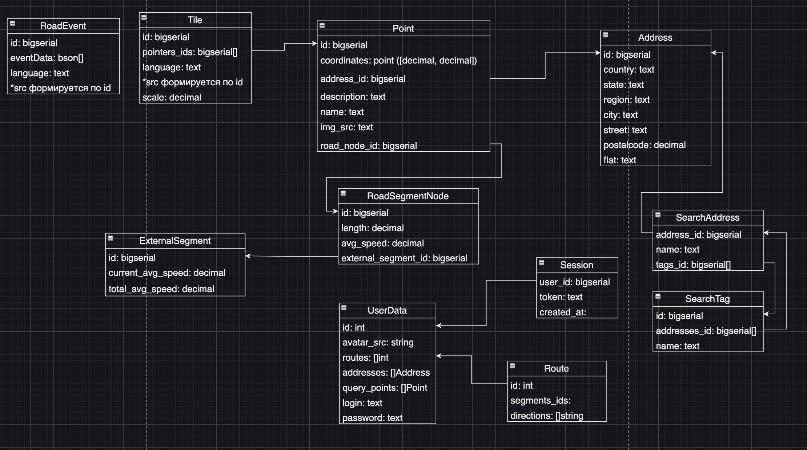
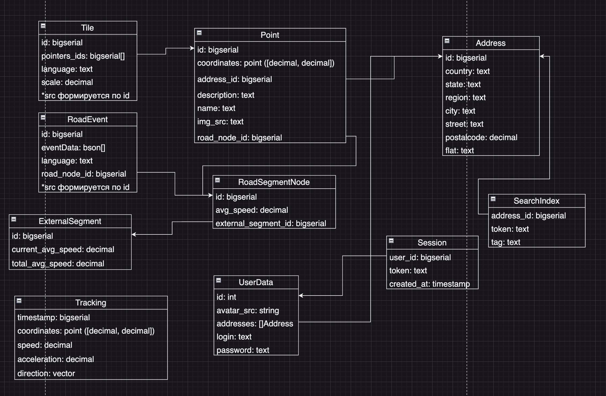
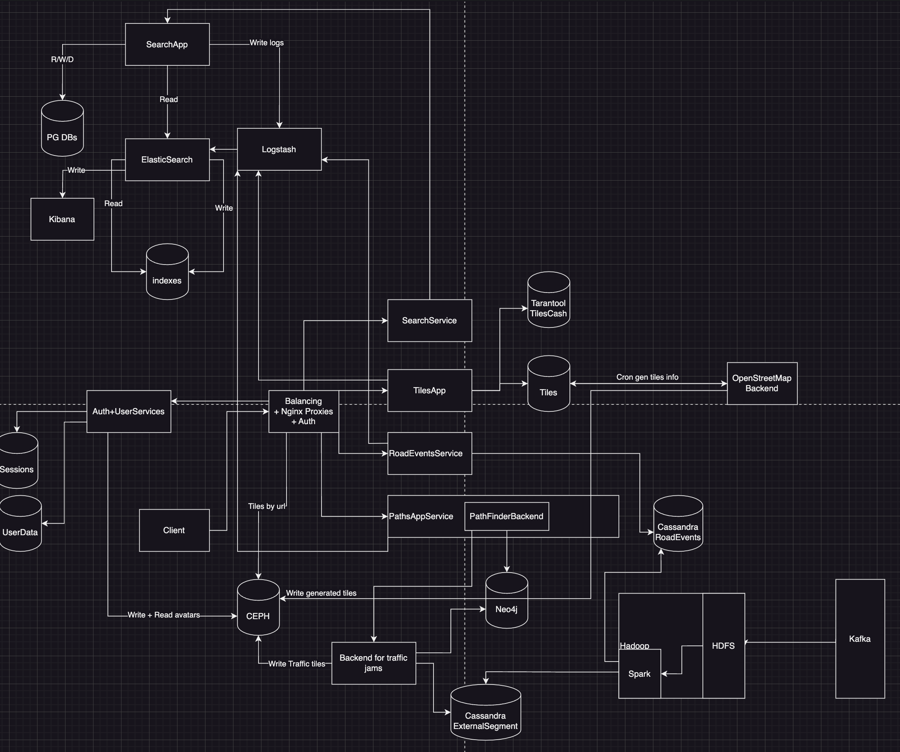
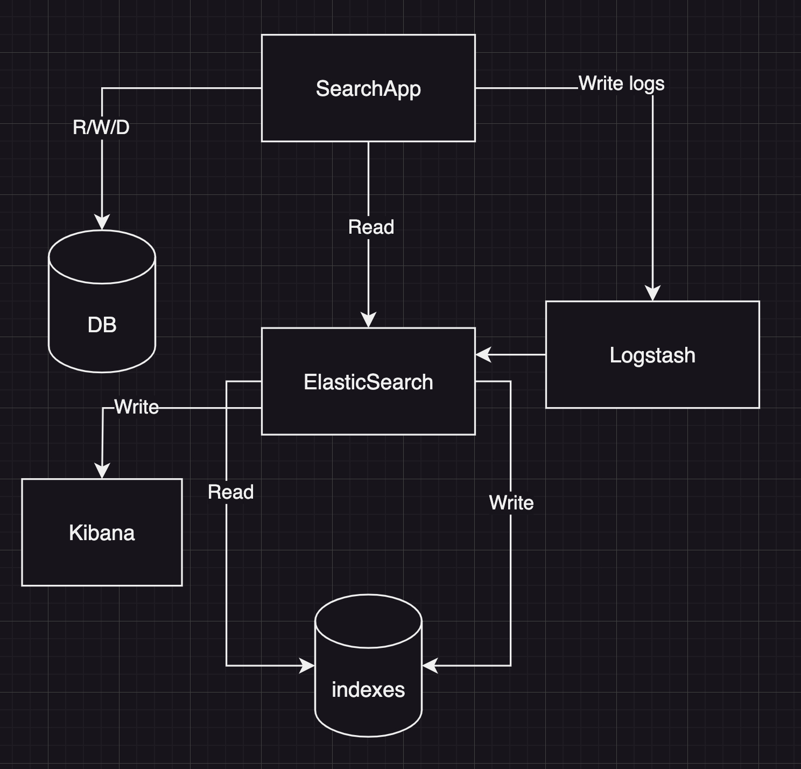

# Репозиторий с проектированием курсовой работы по хайлоаду на тему Яндекс.Карты

## Содержание

- [Репозиторий с проектированием курсовой работы по хайлоаду на тему Яндекс.Карты.](#репозиторий-с-проектированием-курсовой-работы-по-хайлоаду-на-тему-яндекскарты)
  - [Содержание](#содержание)
  - [1. Тема и целевая аудитория](#1-тема-и-целевая-аудитория)
    - [1.1 Тема](#11-тема)
    - [1.2 Целевая аудитория](#12-целевая-аудитория)
    - [1.3 MVP](#13-mvp)
  - [2. Нагрузка](#2-нагрузка)
    - [2.1 Продуктовые метрики](#21-продуктовые-метрики)
    - [2.2 Технические метрики](#22-технические-метрики)
  - [3. Глобальная балансировка](#3-глобальная-балансировка)
  - [4. Локальная балансировка](#4-локальная-балансировка)
  - [5. Логическая схема базы данных](#5-логическая-схема-базы-данных)
  - [6. Физическая схема базы данных](#6-физическая-схема-базы-данных)
  - [7. Алгоритмы](#7-алгоритмы)
  - [8. Технологии](#8-технологии)
  - [9. Схема проекта](#9-схема-проекта)
  - [10. Обеспечение надежности](#10-обеспечение-надежности)
  - [11. Расчёт оборудования](#11-расчёт-оборудования)
  - [Список использованной литературы](#список-использованной-литературы)

## 1. Тема и целевая аудитория

### 1.1 Тема

  Яндекс Карты — поисково-информационная картографическая (ведущее геонавигационное
приложение в России)[^2] система. Есть поиск по карте, информация о пробках, отслеживание городского транспорта, прокладка маршрутов и панорамы улиц крупных и других городов.

Категория - онлайн-карты.

### 1.2 Целевая аудитория

***MAU*** = 50 млн по России.
Клиентами являютcя практически все возрастные слои населения, начиная от школьного возраста, заканчивая современными пенсионерами.

### 1.3 MVP

Основными задачами карт являются[^3]:

1. Отображение карты.
2. Поиск отпределëнных адресов.
3. Поиск групп адресов по тегам (например, "аптека").
4. Построение маршрута с учëтом препятствий, дорог, пробок.
5. Расчёт времени, которое займёт маршрут.

## 2. Нагрузка

### 2.1 Продуктовые метрики

***MAU*** = 50 млн по России.
***DAU*** = 8 млн по России.

На одного пользователя:
Из пользовательских данных обычно:

- аватарка,
- адрес дома и адрес работы (избранные места),
- история поиска по картам, а также построенные маршруты,

Максимум позволяются `1000` адресов в избранном у одного пользователя, в среднем это 2-3 адреса.
В картах хранится история поиска за последние 90 дней. В среднем 2 маршрута и 10 поисковых запросах на пользователя.
Данные взяты из опроса 3 друзей и собственного опыта.

На аватарку `2 Мб`.

Средняя длина поискового запроса на компьютерах — чуть больше четырёх слов, на планшетах — 3,9, на телефонах — уже 3,6[^9]. То есть 4 слова, при средней длине слова 5 символов выходит хранение 5 * 4 байт = 20 байт на запрос, а всего `200 байт`.

Если предположить, что адресная запись содержит основные поля, такие как улица, город, почтовый индекс и страна, а также дополнительные поля, такие как номер дома, номер квартиры и т.д., то средний размер одного адреса может составлять примерно от 100 до 500 байт. Возьмем грубо `300 байт`. Итого на адреса пользователя `600 байт`.

**Среднее количество действий пользователя по типам в день:**

Пользователь запрашивает отображение карты (тайлы), в среднем за одну прогрузку это 36 запросов на получение png картинки. За день допустим это происходит 3 раза на пользователя. Учитывая, что ещё нужно получить сами данные в json (тоже 3 раза за день), а также то, что пользователь нажимает по точкам на карте по 3 раза за сессию. Пользователь строит маршрут, уточняя информацию по точке назначения и путь. Выходит на пользователя:

По результатам опроса 3 друзей.

36 * 3 = `108 запросов` за тайлами в день, `3 запроса` за метками с карты и `2 запроса` (по опыту работы с сервисом яндекс карты, с консоли разработчика) на построение маршрута.

|Продуктовая метрика| Средний размер|
|--|--|
| MAU | `50 млн.` |
| DAU | `8 млн.` |
| Среднее хранилище пользователя | `2 Мб 800 байт` |
| Среднее количество действий пользователя по типам в день | `108 запросов - тайлы, 3 запроса - метки с карты, 2 запроса - построение маршрута` |

### 2.2 Технические метрики

### Хранилища

Пользовательские данные можем посчитать, взяв данные одного пользователя выше и MAU:

    2 Мб 800 байт * 50 000 000 = 95 Тб

Хранимые данные:

- Метки на карте
- Тайлы генятся с апишки внешней и уточняются сервисом, кешируются
- Дорожный граф
- Кеши маршрутов и поиска
  
Используем тайлогенератор OpenStreetMap, города занимают 1-3 процента земного шара, то есть рассчитываем карты и храним, нужно часто прогревать.
Площадь земной поверхности 510 млн кв.км., значит площадь городов до `15.3 млн кв.км.`. При этом коэффициент отношения площади городов к общей поверхности = `0.03`
Остальную область запрашивают значительно реже, при этом точность там тоже не нужна, в рассчёт не берем.

Один тайл представляет собой png размером 256х256px,
В среднем, PNG-изображение с 256x256 пикселей и цветовой глубиной 24 бита (без прозрачности) может занимать примерно `192 килобайта` (KB). Из структуры растровых тайлов[^10][^6] можно понять, что зависит количество тайлов от зума. Максимальный в рамках часто используемых зум = 16, а минимальный = 10 (выяснил опытным путем по картам), итого 4^16 + 4^15 + ... 4^10 = `5 726 273 536 тайлов`, итого мы храним с учетом коэффициента:

    Тайлы (шт): 0.03 * 5 726 273 536 = 171 788 206 штук
    Тайлы: 192 KB * 171 788 206 = 30.7 Тб

Для геокодинга используем базу адресов, пишем на её основе своё решение для России. Можно использовать PostGis.
Протяженность автомобильных дорог с твердым покрытием в России - `984 тыс. км`. На всю Россию получается примерно 14.5 миллионов рёбер[^5]. На ребре нужна средняя скорость, а также текущее состояние - настоящая средняя скорость (учитывая пробки), длина сегмента, прочие данные. Всего 1 ребро займет не больше `1 Кбайта`.

    Дорожный граф: 14 500 000 * 1 Кбайт = 13.8 Гб

Метка в картах занимает около `50 Кбайт` (померил с помощью софта по json и апи карт яндекса). Всего юр лиц в стране 3.31 млн[^11], физических точек минимум в 10 раз больше. Имеем:

    Метки: 50 Кбайт * 3 310 000 * 10 = 1.58 Тб

| Тип данных | Размер в Тб |
|--|--|
| Пользовательские | 95 Тб |
| Тайлы | 30.7 Тб |
| Дорожный граф | 13.8 Гб |
| Маршруты | 13.8 Гб |
| Метки (адреса) | 1.58 Тб |

### RPS

- Запрос за пользовательскими данными
- Получение тайлов (именно картинок при рисовке карты)
- Инфа про метки на тайле приходит с одним запросом данных на карту
- Уточнения по карте (поиск)
- Запрос за пробками и дорожными событиями (одна ручка на объект)
- Нагрузка на внешние сервисы апи (OpenStreetMap)

Пользователь запрашивает аватарку, свои маршруты и 10 поисковых запросов по 2 раза в день (при условии, что эти данные не кешируется между 2 сессиями пользователя, когда он заходит для построения маршрута).

    (2 * 3 запроса * 50 000 000) / (24 * 60 * 60 * 31) = 112 запросов / сек

Один пользователь за день запрашивает из рассчётов выше `108 тайлов`, с ними 3 запроса за информацией по карте.

    (111 * 8 000 000) / (24 * 60 * 60) = 10 277 запросов / сек

Запросы поиска (и любой геокодинг) - это 5-10 раз за день использования:

    (10 * 8 000 000) / (24 * 60 * 60) = 926 запросов / сек

Запрос за пробками и дорожными событиями каждые 30 сек, если взять час отслеживания в день:

    (120 * 8 000 000) / (24 * 60 * 60) = 11 111 запросов / сек

Раз в 30 секунд при подключенных пробках и/или событиях на дорогах идёт сбор показателей и обновление с небольшой задержкой.
Трекинг GPS тратит `175 байт` трафика за одну отправку данных[^12]. По информации ChatGPT в час вебсокет на поддержание соединения тратит `1200 байт`, в секунду `0.3 байта` . Тогда из рассчёта, что на пользователя используется вебсокет и при этом постоянная отправка gps трекера при использовании, получим на одного человека в сутки примерно на средний маршрут в 1 час, а это раз в 10 секунд трекинг - 60 * 60 / 10 = `360 запросов в сутки`.

Запросы на построение маршрута - это 1-2 маршрута в день на пользователя (при роутинге х10 минимум), перестройка маршрута с учётом событий на дорогах могут дать оверхед в передаче с сервера других маршрутов через вебсокет, то есть считаем, что tcp соединение идёт в течение часа в день на пользователя:

    Роутинг маршрута: ((360 / 24 + 1) 8 000 000) / (60 * 60) = 35 555 запроса (считая 2222 соеднинения по вебсокету) / сек
    Построение маршрута: 2 * 10 * 8 000 000 / (24 * 60 * 60) = 1 852 запроса / сек

**Пиковый RPS и трафик считаем в 2 раза больше дефолтного.**

| Тип запроса | Данные пользователя | Роутинг маршрута | Построение маршрута | Тайлы | Поиск | Пробки и дорожные события | Общий rps (MAX) |
|--|--|--|--|--|--|--|--|
| Cредний | 112 rps  | 35 555 rps| 1 852 rps | 10 277 rps | 926 rps | 11 111 rps | 60 277 rps |
| Пиковый | 224 rps | 71 110 rps | 3 704 rps | 20 554 rps | 1 852 rps | 22 222 rps | 120 554 rps |

`Пользователей с запросами за своими данными в ДЦО в Мск по отдельному домену`, чтобы не городить тяжелой логики с распространением контента данного вида, при этом rps там низкий.

### Сетевой трафик

Пользовательские данные:

    Трафик: 16 Мбит * 112 запросов / сек = 1.75 Гбит/сек
    Пиковое потребление: 3.5 Гбит/сек
    Суточный: 18 900 Гб/сут

Роутинг маршрута:

    Трафик: ((175 байт * 360 * 8 000 000) / (24 * 60 * 60) + 20 байт * 2222 соединения) * 8 = 5.6 Мбит/сек
    Пиковое потребление: 11.2 Мбит/сек
    Суточный: (175 байт * 360 + 1200 байт) * 8 000 000 = 1375 байт * 8 000 000 = 477 Гб/сут

Построение маршрута:

    Трафик: 16 Мбит * 1852 запросов / сек = 29 Гбит/сек
    Пиковое потребление: 58 Гбит/сек
    Суточный: 313 200 Гб/сут

Тайлы:

    Трафик: 1536 Кбит * 10277 запросов / сек = 15 Гбит/сек
    Пиковое потребление: 30 Гбит/сек
    Суточный: 162 000 Гб/сут

Поиск:

    Трафик: 400 Кбит * 926 запросов / сек = 361 Мбит/сек
    Пиковое потребление: 722 Мбит/сек
    Суточный: 3 807 Гб/сут

Всего в Москве (крупнейший город в России) 5 000 улиц[^13], при этом взяв, что сегментов дорог 25 000, получим, что один пользователь будет запрашивать 1/100 часть равную около `2500 сегментов` весом по 1 Кб каждый, итого `2.4 Мб` на один запрос.

Пробки и дорожные события:

    Трафик: 2.4 Мб * 11111 запросов / сек = 26.5 Гбит/сек
    Пиковое потребление: 53 Гбит/сек
    Суточный: 262 200 Гб/сут

| Тип запроса | Пользовательские данные | Роутинг маршрута | Построение маршрута | Тайлы | Поиск | Пробки и дорожные события | Общий трафик (на балансере) |
|--|--|--|--|--|--|--|--|
| Cредний | 1.75 Гбит/сек | 5.6 Мбит/сек | 29 Гбит/сек | 15 Гбит/сек | 361 Мбит/сек | 26.5 Гбит/сек | 72.6 Гбит/сек |
| Пиковый | 3.5 Гбит/сек | 11.2 Мбит/сек | 58 Гбит/сек | 30 Гбит/сек | 722 Мбит/сек | 53 Гбит/сек | 145.2 Гбит/сек |

## 3. Глобальная балансировка

### Расположение ДЦ

Аудитория проекта - граждане РФ, следовательно расположим ЦОДы в горячих точках страны. Чтобы покрыть всю страну, при этом учитывая плотность населения по субъектам[^15], выберем следующие точки:

| Расположение по городам |
|--|
| Москва |
| Удомля |
| Санкт-Петербуг |
| Екатеринбург |
| Новосибирск |
| Владивосток |

### Расчет распределение запросов

Локально запросы делятся на 5 зон (все ДЦ, кроме Удомли, он резервный для Москва-СПБ). Пиковый общий RPS (на балансеры) у нас - `120 554 rps`. Из той же плотности населения[^15][^19] выясним проценты пользователей по точкам, притом считаем, что в Мск ходит Центральный, Южный и Северо-Кавказский округи и Северо-Западный на СПБ, а прочие распределенно в Екатеринбург, Новосибирск и Владивосток.

    Москва: 42.4% * 120 554 = 51 235 rps.
    СПБ: 10.6% * 120 554 = 12 779 rps.

Около 14 процентов на Сибирь (Новосибирск) и 11 процентов на зону ЕКБ (Приволжский + Уральский округи), а также 5 процентов на дальний восток:

    Екатеринбург: 28% * 120 554 = 33 755 rps.
    Новосибирск: 14% * 120 554 = 16 878 rps.
    Владивосток: 5% * 120 554 = 6 028 rps.

| ДЦО | RPS |
|--|--|
| Москва | 51 235 |
| Санкт-Петербуг | 12 779 |
| Екатеринбург | 33 755 |
| Новосибирск | 16 878 |
| Владивосток | 6 028 |

**Поправка:** -556 rps на пользовательскую инфу всем ЦОДам, кроме Москвы, так как данные хранятся в Московском ДЦ.

## Балансировка нагрузки

Используем собственную автономную сеть с маской /24, тогда мы сможем настроить `BGP Anycast`. По факту посылаем на один общий (anycast) для всех физических ЦОДов ip, как 8.8.8.8 гугла.

`BGP` - динамический протокол маршрутизации преимущественно глобальной сети Интернета. Для нас важно правильно настроить точки присутствия и внутренне сконфигурировать hopы для лучшего определения нужного ЦОДа для конкретного клиента. На наши 6 дата центров нам придётся анонсить соотвественно `6 AN` с anycast, тогда по глобальной таблице маршрутизации выйдет зарезолвить нашу сетевую систему и направить пользователя по правильному пути.

Исходя из [^16] и [^17] можно сделать вывод, что у BGP есть две важных проблемы, которые нужно решить, а именно это:

- Невозможность определить реальную нагруженность приёма ДЦ в реальный момент врмемени, а также дешевый маршрут не всегда надежный;
- Крупные операторы (TIER1) имеют множество точек присутствия, то есть может быть кейс подключения через Америку вместо местного оператора из-за меньших хопов, а так как мы по-любому будем подключаться к таким операторам, нужно придумать, как конфигурировать BGP.

Первая проблема сложно решаема, так как какой-нибудь latency-based DNS бы помог, но его по сути нужно реализовывать самим, так как мы не подключены к облачным сервисам. Вторая проблема решается[^18] фальшивыми hop'ами в виде дополнительных роутеров на таких операторов, что повышает кол-во точек отказа, но помогает конфигурировать bgp. Для смягчения обеих проблем мы сделаем свой софт, который будет считать путь до серверов исходя из глобальной ситуации, а также прочих метрик-состояний нашего сервиса (такие, как неправильные хопы, нагрузка на текущих ЦОДах, особенности ландшафта и расположения реальных магистралей по пути следования). В итоге `используя такую программу` на клиенте или DNS, получим лучший результат.

У нас полноценный CDN для статики (по сути всех расмотренных в пункте 2 данных), а также кеширования. Помимо реализуем `fallback на GEOIP DNS`.

## 4. Локальная балансировка

Virtual Server via Direct Routing (L4) + L7 на nginx;

### Входная схема балансировки

Первый контур чисто на сетевом оборудовании, для отказоустойчивости. Далее условно к каждому физическому серверу, проксирующему Apps, мы подключаемся через балансеры, при этом трафик с сети распределяется на несколько балансеров. Используем VSviaDR, чтобы не упереться по выходному трафику в балансер L4.

### Схема отказоучстойчивости и L7 балансировки

Структура Service Mesh'а:

На картинке структура стандартного Service Mesh в кубере[^14], Control Plane (тот же Service Discovery) отвечает за назначение и распространение политик маршрутизации трафика, артефакты, безопасность, токены, ключи, сертификаты. А еще за сбор телеметрии и интеграцию с внешней инфраструктурой. Чаще всего это PKI, журналирование, мониторинг и т. д.

Sidecar Proxy (Data Plane) размещается непосредственно с приложениями и занимается очень простым делом: исполняет политики, которые получает от Control Plane. Соответственно, Data Plane — это чаще всего сетевые прокси, которые отвечают за маршрутизацию и балансировку трафика в нагруженной среде. Также Data Plane выполняет аутентификацию, авторизацию всех вызовов, формирует спаны для распределенной трассировки и метрики для того, чтобы повысить уровень обозреваемости микросервисных систем.

За `sidecar proxy` берем `nginx`. Это L7 балансер, который поддерживает очень много фич. На нём же у нас происходит `терминация SSL`, при этом будем пользовать Session cache. Тянет он около 96 000 коннектов[^20].

Так как у нас геопозиционный сервис, который отправляет трекинг шорт поллингом и может быть необходимость включать вебсокеты, то будем использовать Redirect Based Load Balancing. Сценарий: пользователь начал пользоваться навигационными фичами, тогда мы в локальном слое балансировки посылаем его на `точно` ближайший и/или `наименее нагруженный` сервер для дальнейшей продолжительной работы.

## 5. Логическая схема базы данных

Здесь распишем таблички для кешей и базы тайлов, маршрутов, дорожного графа, меток на карте и пр.

### Расчёт RW

По данным новых пользователей Яндекса 90 млн. уникальных человек в месяц, значит хранилище под UserData и Session мы обособленно поделим на эти 90 млн. чел. Если грубо считать, что все они логинятся раз в месяц и запрашивают свои данные, то выйдет:

    UserData и Session RPS: 90 млн.ч. / (31 * 24 * 60 * 60) = 33.6 RPS.

Так как маршрутов у пользователя по 3 (в среднем ранее высчитанное значение):

    Route: 90 млн.ч. * 3 / (31 * 24 * 60 * 60) = 100 RPS.

Для Tile и RoadEvents возьмем один подсчитанный RPS на чтение `10 277 rps`. Запись Tile посчитаем от обновления 30 процентов тайлов в месяц для актуализации:

    (0.1 * 171 788 206 шт.) / (31 * 24 * 60 * 60) = 20 записей в секунду.

Для RoadEvents сложнее, если взять допустимый интервал обновления раз в 5 минут:

    171 788 206 шт. / (5 * 60) = 572 627 операций записи в секунду.

RoadSegmentNode обновляем поле avg_speed раз в день

    1 / (24 * 60 * 60) = близко к 0.

ExternalSegment - 15 млн. ребер раз в 5 минут:

    15 000 000 / (5 * 60) = 50 000 записей в секунду.

Address под нагрузкой от запросов к тайлам + запросов к поиску
    10 277 RPS + 926 RPS = 11 203 RPS.

**Нагрузка на таблицы по rps:**

| Таблица | Запись / сек | Чтение |
|--|--|--|
| Tile | 20 | 10 277 RPS |
| RoadEvent | 572 627 | 11 111 RPS |
| UserData | 33.6 | 33.6 RPS |
| Session | 33.6 | 33.6 RPS |
| Route | 100 | 100 RPS |
| Point | после индексации (около 0) | 10 277 RPS |
| Address | после индексации (около 0) | 926 RPS + 10 277 RPS |
| RoadSegmentNode | 0 | 3704 RPS |
| ExternalSegment | 50 000 | 3704 RPS |
| SearchAddress | 0 | 926 RPS |
| SearchTag | 0 | 926 RPS |

### Таблички

## 6. Физическая схема базы данных

### 6.1 Базы данных

`PostgreSQL` - реляционная СУБД для хранения основных данных.

`Cassandra` - NoSQL СУБД для одновременного чтения и записи.

`MemCacheD` - простой сценарий кеширования, подразумевающий алгоритм вытеснения данных. Тайлы кешируем `Tarantool'ом` по регионам (т.е. зона под физический датацентр). Тогда будет высокий кеш рейт.

`Neo4j` - графовая СУБД. Она использует cypher api (язык запросов похож на смесь SQL и JS). Поскольку наш граф занимает всего `13.8 Гб`, нам hadoop не нужен, графовая (сетевая) СУБД подходит для всех наших целей на построения маршрутов, используя дорожный граф.

`HADOOP + Spark` - BigData СУБД для работы над

`CEPH` - OpenSource S3 для тайлов.

`Tarantool` - решение для кешей Tiles на тайлы по MemCacheD.

### 6.2 Шардирование и резервирование СУБД

Используем два вида шардинга - классические шарды и партицирование в NOSQL субд. Можно брать номер шарда, как хеш от айди (ограничиваем количеством шардов). При этом лучше делать прешардирование. Создаем заранее большое кол-во шардов.

### 6.3 Схема резервного копирования

Делаем 2 реплики Master-Slave на один инстанс СУБД:

1. Горячий резерв (быстрая замена при отвале мастера);
2. Для снятия бекапа (так как нагрузка дикая).

### 6.4 Разбиение по таблицам

### Таблица Tile на PostgreSQL и кеши на Tarantool

***Структура***

| Поле | Назначение | Размер |
|--|--|--|
| id | PK формируется на клиенте и однозначно определяет png ресурс и строку в таблице | 8 байт |
| language | Строка формата 'ru_Ru' или 'en_En', определяет язык отображения | 5-10 байт |
| scale | Дробное число вроде 2.00, показывающее, какой размер png используется (от 24*24 до 512*512) | 6 байт |
| pointers_ids | массив с отсортированными графически айдишниками точек на тайле  | 8 * X байт |
| Итого |  | около 40 байт на строку |
| Всего |  | 6.4 Гб |

***Индексы***

Индексируем Tiles под язык отображения:

    CREATE INDEX tiles_index ON Tile (language);

### Таблица Point на PostgreSQL

***Структура***

| Поле | Назначение | Размер |
|--|--|--|
| id | PK | 8 байт |
| description | Строка текста для описания точки | 50-100 байт |
| name | Строка с названием места (точки) | 20 байт |
| img_src | Ссылка на картинку по метке строкового формата | 6 байт |
| coordinates | Координата для PostGIS Spatial index | 16 байт |
| road_node_id | Ссылка на ноду в дорожном графе | 8 байт |
| address_id | Ссылка FK на адрес | 8 байт |
| Итого |  | 158 байт на строку |
| Всего |  | 0.5 Гб |

***Индексы***

Индексируем Points:

    CREATE INDEX point_address_index ON Point (address);
    CREATE INDEX geom_idx ON Point USING GIST (coordinates);  // spatial index

### Таблица Address на PostgreSQL

***Структура***

| Поле | Назначение | Размер |
|--|--|--|
| id | PK | 8 байт |
| от country до flat | Строки для обозначения адреса | 50 * 6 байт |
| postalcode | Zip код | 15 байт |
| Итого |  | 323 байта на строку |
| Всего |  | 1 Гб |

### Таблица UserData на PostgreSQL и Session на Tarantool

***Структура UserData***

| Поле | Назначение | Размер |
|--|--|--|
| id | PK | 8 байт |
| avatar_src | Src на пользовательскую аву | 6 байт |
| addresses | Массив ссылок на адреса пользователей | 3 * 8 байт |
| login | Логин пользователя | 30 байт |
| password (hash) | Хеш пароля | 16 байт |
| Итого |  | 84 байта на строку |
| Всего |  | 8 Гб |

***Структура UserData***

| Поле | Назначение | Размер |
|--|--|--|
| id | PK | 8 байт |
| user_id | Ссылка на пользователя | 8 байт |
| token | Кука | 16 байт |
| created_at | Дата авторизации | 8 байт |
| Итого |  | 40 байт на строку |
| Всего |  | 3.35 Гб |

### Таблица под SearchIndex на ElasticSearch

***Структура***

| Поле | Назначение | Размер |
|--|--|--|
| id | PK формируется на клиенте и однозначно определяет png ресурс и строку в таблице | 8 байт |
| address_id | Внешний id на адрес | 8 байт |
| token | Строка после токенизации | 20 байт |
| tag | Строка для подходящего тега (вроде аптека или продуктовый магазин) | 20 байт |
| Итого |  | 56 байт на строку |
| Всего |  | 17 Гб |

***Индексы***

Бекенд питона создаёт индекс для анализатора по токенам и поиска конкретного адреса или адресов по тегу.

***Шардинг***

По умолчанию для ES есть шардинг из коробки, требуется выделить на шард 20-25 Гб по рекомендациям[^26]. То есть по данным хватит и `1 шарда`. При этом есть понятие о клиенте на поиск - один клиент на 8 ядерном процессоре тянет порядка `160 RPS`, считаем, что нужно `7 таких клиентов` на наш RPS.

### Таблица RoadSegmentNode на Neo4j

***Структура***

| Поле | Назначение | Размер |
|--|--|--|
| id | PK | 8 байт |
| avg_speed | средняя скорость на ноде | 15 байт |
| external_segment_id | ссылка на внешнюю таблицу для учёта пробок | 8 байт |
| Итого |  | 31 байта на строку |
| Всего |  | 0.41 Гб |

### Таблица ExternalSegment на Cassandra

***Структура***

| Поле | Назначение | Размер |
|--|--|--|
| id | PK | 8 байт |
| current_avg_speed | текущая средняя скорость на ноде | 8 байт |
| total_avg_speed | средняя скорость на ноде за день (обновляется кроной) | 8 байт |
| Итого |  | 24 байта на строку |
| Всего |  | 0.33 Гб |

***Индексы***

    CREATE INDEX current_speed_index ON ExternalSegment (current_avg_speed);
    CREATE INDEX total_speed_index ON ExternalSegment (total_avg_speed);

### Таблица RoadEvent на Cassandra

***Структура***

| Поле | Назначение | Размер |
|--|--|--|
| id | PK формируется на клиенте и однозначно определяет png ресурс и строку в таблице | 8 байт |
| eventData | Bsonы, внутри которых хранится метаинформация про дорожные события | 1 Кбайт |
| language | Строка формата 'ru_Ru' или 'en_En', определяет язык отображения | 5-10 байт |
| Итого |  | 1042 байта на строку |
| Всего |  | 167 Гб |

***Индексы***

    CREATE INDEX language_index ON RoadEvent (language);

### Таблица Tracking на Hadoop и Kafka

***Структура***

| Поле | Назначение | Размер |
|--|--|--|
| timestamp | Время отправки трекинга | 8 байт |
| coordinates | Координата трекинга | 16 байт |
| speed | Скорость трекера | 8 байт |
| acceleration | Ускорение трекера | 8 байт |
| direction | Вектор направления | 24 байта |
| Итого |  | 64 байта на строку |
| Всего |  | 0.63 Гб за 5 минут |

В Hadoop хранится `за день` информация для анализа, трекеры подчищаются в спокойные моменты.

### Сводная таблица

Субд | Таблицы | Функционал | Нагрузка   чтение | Нагрузка   запись в сек | Занимаемое место | Шардирование |
|-|-|-|-|-|-|-|
| Hadoop | Tracking | СУБД для агрегации трекеров в информацию о сегментах дорожного графа | за 5 минут из Kafka  приходит 10 500 000 событий весом 0.63 Гб | 35 000 | 180 Гб | Используя вместе со Spark мы используем шардированные ноды HDFS и внешний код для агрегации |
| ElasticSearch | SearchIndex | Индексы на поиск | 926 RPS | 0 | 17Гб | Шардирование из коробки, также создаём 7 клиентов-воркеров для низких задержек на запросы |
| Kafka | Tracking | Принимает внешние трекеры с утройств пользователей | Раз в 5 минут | 35 000 | 0.63 Гб |  Заводим нужное количество тредов на нагрузку, делаем партиции |
| Tarantool |  Session и Tiles | Кешируем данные, получаем готовые ответы со всей информацией | 10 310 RPS | 60 | 2ГБ индексы   390ГБ данные | VShard[^27] для шардирования по бакетам, а также создадим реплик для выдержки RPS |
| Cassandra |  ExternalSegment и RoadEvent | Высокая нагрузка на запись данных в купе с масштабируемостью | 14 815 RPS | 622 627 | 167.4Гб данные | Необходимо сконфигурировать фактор репликации (RF) и количество нод (шардов N), чтобы выдержать нагрузку записи |
| CEPH | Tiles (png) и аватарки | S3 хранилище для тяжелых данных | 21 388 RPS | 572 650 | 157 Тб | CEPH можно скалироваться до миллиардов объектов в сумме по множеству бакетов[^28] |
| Neo4j | RoadSegmentNode | Храним граф дорог | 3 704 RPS | 1 | 0.41Гб данные |  |
| PostgreSQL | Tile, Point, Address, UserData | Используем для сбора основных данных системы | 31 790 RPS | 33.6 | 1ГБ индексы   16Гб данные | Создаём реплики для эффективности чтения и отказоустойчивости |

## 7. Алгоритмы

### 7.1 Построение маршрутов

Для построения маршрутов[^1] мы используем алгоритм A*[^23], это тот же алгоритм Дейкстры, но при этом он использует эвристику, то есть использует некие параметры для предположения о дальнейшем пути. Маршруты строятся для пользователя, кешируются на его устройстве.

Алгоритм внутри работает следующим образом:

- Из графовой базы забираем по внутреннему API маршрут (сегменты)[^24].
- Читаем из динамической key-value по external_segment_id ключу.
- Далее считаем цену маршрута и мапим со служебной инфой (для построения).

Алгоритм роутинга будет работать на постоянном трекинге (обращения пользователя в анализатор положения), далее идёт отслеживание по карте по алгоритму[^22].

### 7.2 Агрегация событий на дороге

Алгоритм дорожных пробок работает посредством специального аналитического алгоритма[^21][^22].

- Треки GPS (агрегированные оттуда данные) поступают на распределенные ноды (хранилища) Hadoop через Kafka раз в какое-то время. Посчитать справится ли хадуп. У него проблема в том, что он плохо работает с распараллеливанием процессов и может быть занят потом на запуске процесса.
- Далее Spark поверх стораджа считает скорости по нодам. Пушим в Cassandra. Кассандра тянет 1 млн записей в сек[^25], `15 сек на все ноды` для дорожного графа с запасом.
- Когда приходит запрос на расчёт расстрояния с учётом пробок, мы берем актуальные данные после получения сегментов по айди из Кассандры.
- Обновляем тайлы дорожных событий (раз в 5 минут).
- Кроной обновляем среднюю скорость на нодах дорожного графа условно `раз в день ночью`, внутри айдишники на строку из Кассандры, читаем.

### 7.3 Геокодирование

Прямое и обратное геокодирование реализуется решением на постгресе (PostGis)[^5], если не устроит, то пишем своё решение для решения проблемы дубликатов иностранных адресов.

### 7.4 Генерация id тайла

- Айдишники тайлов генерируется на клиенте из x, y, z координат и параметра scale.
- Далее идёт батч запрос за метаинформацией (адресами) по тайлами.
- При этом сами png запрашиваются с бекенда S3.
- Если тайл не найден, приходит 404 и отображается затемнением области.

## 8. Технологии

| Технология  | Область применения | Обоснование |
|--|--|--|
| Python | Backend и скрипты | Язык для написания скриптов Spark и Elastic и бекенда |
| ELK | Стек для полнотекстового поиска и хранения логов | Прост в в развертывании, а также легко масштабируется и прокачивается |
| Spark | СУБД | Скрипты питона над hadoop хранилищем для перевода трекеров в дорожные события |
| Hadoop | BigData СУБД | Используем в связке со Spark |
| React | Frontend | Умный клиент для тяжелых задач визуализации карты и математических функций |
| Typescript | Frontend Typing | Типизация позволит стабильнее писать клиентский код |
| Tarantool | In-memory СУБД | Позволяет работать с кешами в режиме MemcacheD |
| Neo4j | Графовая СУБД | Подходит для построения дорожного графа и операциям построения маршрута над ним |
| Cassandra | Дисковая СУБД | Позволяет быстро и надежно писать/читать в хранилище |
| PostgreSQL  | Хранение данных | Надежная реляционная СУБД и известные принципы обеспечения надежности |
| Docker      | Виртуализация | Локальная разработка, унификация процессов |
| Kubernetes  | Оркестрация контейнеров | Служит для ServiceMesh'а |
| CEPH | S3 хранилище | Для хранения тайлов (png) |

## 9. Схема проекта

### Search APP отдельно

## 10. Обеспечение надежности

В системе используем N + 1 резервирование. То есть все бекенды, балансеры и хранилища резервируются как общее количество машин типа + 1.

### Надежность СУБД

| СУБД | Критерии надежности |
|-|-|
| PostgreSQL | Используем 2 реплики Master-Slave на сервер и Patroni на kubernetes с etcd для контроля отказов и быстрого включения реплики. Строим подобные кластеры на каждый вид данных[^29]. |
| Cassandra | СУБД рассчитана под преобладание записи над чтением, согласованность узлов помогает мониторить успешность записи в узлы, а также чтения. Запись в commit log позволяет восстановить записанные туда транзакции при старте. |
| Neo4j | Когда тяжеловесная Neo4j логика упала и уронила инстанс базы, мы помечаем его нерабочим и ожидаем поднятия, не отправляя туда запросы, тем самым понижая latency и не добивая инстанс (Circuit Breaker). |
| CEPH | Используя мониторы и MDS (серверный оркестратор), а также встроенные дашборды и алерты получаем мгновенно информацию о возмодной смерти OSD, а также по-умному создаётся новый osdmap, позже он активируется[^31]. |
| ELK | Помимо индексов на поиск, этот стек позволяет собирать метрики и логи для крупной системы. Сам по себе Elastic умеет при тщательной настройке делать failover  на другие узлы кластера. |
| Hadoop | Храним временные данные из Kafka в течение дня, удаляя их в неактивные периоды суток. Хранимые данные становятся быстро неактуальны, при этом удалять их сразу тяжело для hadoop'а. |
| Kafka | На каждом брокере RF = 3 (default), два фолловера для отказоустойчивости и избыточности. Каждый кластер Kafka развертывается вместе с кластером Zookeeper (2PC). |

### Надежность общие используемые паттерны

| Паттерн | Обоснование |
|-|-|
| Saga | Удобство полного отката транзакции. В нашей системе такие транзакции цепочкой идут на много ресурсов (и в разных сервисах) при подсчёте дорожных событий, удобен полный откат до начального состояния |
| Паттерн 'Тыква' | Больше относится к бекендам, суть - крайняя точка при отвале основного функционала системы => переключение на легковесную заглушку[^30] с частично реализованной логикой |
| CQRS и 2PC | Реализуем логику двухфазового коммита для всех хранилищ с приоритетными операциями записи, а также разделяем взаимодейстие на потоки записи и чтения в такие хранилища |
| Неработающие кеши | Все системы, использующие кеши, расчитаны на работу без кешей в штатном режиме |
| Kubernetes | Оркестрация позволяет делать отслеживание рабочих бекендов по service discovery, а также переносить контейнеры между сервисами |

### Надежность ДЦ

Как было указано выше (раздел 3) предусмотрен fallback на GEOIP DNS, если датацентр не отвечает. Другие критерии расписаны в 4 главе.

***Некоторые особенные кейсы:***

| Предмет | Особенность в отношении расположения по ДЦ |
|-|-|
| Пользовательские данные | Храним на одном ДЦ в Москве, весь такой трафик будет идти на него |
| PG, Cassandra и прочее | На каждом ДЦ разворачиваются под свою номинальную нагрузку |

## 11. Расчёт оборудования

Бенчмарки на питоновские вер-сервера[^32]. Выходит на 8Гб ОЗУ приблизительно 4000 RPS на какую-то легкую вебсерверную логику, тогда на среднюю 400 RPS, а на сложную 40 RPS считаем:

    Легкий код питон: 4000 RPS / 8 Гб = 500 RPS/Гб
    Средний код питон: 400 RPS / 8 Гб = 50 RPS/Гб
    Тяжелый код питон: 40 RPS / 8 Гб = 5 RPS/Гб

### Распределение ресурсов по сервисам

| Сервис | Целевая пиковая нагрузка   приложения | CPU | RAM | Net
| -- | -- | ----- | ------- | -------- |
| Tiles | 10 277 RPS | 20 | 206 ГБ   | 30 Гбит/сек  |
| Search | 926 RPS | 100   | 20 ГБ   | 722 Мбит/сек |
| PathFinder (построение маршрута) | 1 852 RPS | 330 | 30 ГБ | 58 Гбит/сек |
| PathFinder (роутинг маршрута) | 2 222 соединения по вебсокету[^33] | 5 | 45 ГБ | 11.2 Мбит/сек |
| RoadEvents | 11 111 RPS | 22 | 222 ГБ | 53 Гбит/сек  |
| Auth | 100 RPS | 2   | 2 ГБ   | 2 Гбит/c   |
| User | 100 RPS | 2  | 2 ГБ  | 3.5 Гбит/с   |

### Конфигурация по оборудованию с амортизированной стоимостью

| Сервис | Хостинг |Конфигурация | Cores | Cnt | Цена |
|--|--|--|--|--|--|
| Tiles | own | CyberServe EPYC EP1-102 / AMD EPYC 7313P - 16 Cores /  1х128Гб | 20 | 2  | € 100 |
| RoadEvents | own | CyberServe EPYC EP1-102 / AMD EPYC 7313P - 16 Cores /  1х128Гб | 22 | 2 | € 100 |
| Auth + User | own | CyberServe Atom-100i  / A2SDI-4C-HLN4F- 4-Core /  1x4GB | 4 | 1   | € 13 |
| Search | own  | CyberServe EPYC EP1-102 / AMD EPYC 7573X - 32 Cores /  1x8GB | 100 | 32  | €  4 400 |
| PathFinder (построение маршрута)  | own | CyberServe EPYC EP1-102 / AMD EPYC 7573X - 32 Cores /  1x8GB |  330   |  7   | €  1 000 |
| PathFinder (роутинг маршрута)  | own   | CyberServe EPYC EP1-102 / AMD EPYC 7573X - 32 Cores /  1x8GB |  5   |  7   | €  1 000 |
| Балансировщики | own | CyberServe EPYC EP1-102 / AMD EPYC 7573X - 32 Cores /  1x8GB |  24   | 90  | € 12 318 |
| Elasticsearch | own  | CyberStore 472S 12GB/s Storage Server / Intel Xeon Silver 4316 Processor 20 Cores /  RAM 16x128GB / HDD 72x2.4TB |  20   |     5 | €      1 500  |
| PostgreSQL | own | CyberStore 472S 12GB/s Storage Server / Intel Xeon Silver 4316 Processor 20 Cores /  RAM 16x128GB / HDD 72x2.4TB |  20   |    10 | €      3 000  |
| Tarantool | own | CyberStore 212S 12GB/s Storage Server / Intel Xeon Silver 4310 Processor 12 Cores /  RAM 8x8GB / HDD 1x1TB       |  12   |     5 | €        500  |
| CEPH | own | CyberStore 472S 12GB/s Storage Server / Intel Xeon Silver 4316 Processor 20 Cores /  RAM 16x128GB / HDD 72x2.4TB |  20   | 5 926 | €  1 778 000  |
| Hadoop + Spark | own | CyberStore 472S 12GB/s Storage Server / Intel Xeon Silver 4316 Processor 20 Cores /  RAM 16x128GB / HDD 72x2.4TB |  20   | 5 926 | €  1 778 000  |
| Cassandra | own | CyberStore 472S 12GB/s Storage Server / Intel Xeon Silver 4316 Processor 20 Cores /  RAM 16x128GB / HDD 72x2.4TB |  20   | 5 926 | €  1 778 000  |
| Neo4j | own | CyberStore 472S 12GB/s Storage Server / Intel Xeon Silver 4316 Processor 20 Cores /  RAM 16x128GB / HDD 72x2.4TB |  20   | 5 926 | €  1 778 000  |

## Список использованной литературы

[^1]: [Маршрутизация в приложении](https://yandex.ru/company/technologies/routes/)
[^5]: [Маршрутизация в опенсорс решении](https://habr.com/ru/companies/vk/articles/262185/)
[^2]: [Отчёт за квартал 2023 года Яндекс](https://yastatic.net/s3/ir-docs/events/2023/IR_2Q2023_RUS.pdf)
[^3]: [Информация по рекламе сервиса Яндекс.Карты](https://skillbox.ru/media/marketing/rukovodstvo-po-reklame-na-yandeks-kartakh-kak-ona-rabotaet-skolko-stoit-i-kak-nastroit/)
[^6]: [Апи тайлов] (<https://yandex.ru/dev/tiles/doc/ru/>)
[^7]: [Хранение данных карт] (<https://vashmirpc.ru/gde-xranyatsya-karty-yandeks-navigatora/>)
[^9]: (<https://yandex.ru/company/researches/2016/ya_search_2016#kolichestvopolzovatelejjizaprosov>)
[^10]: (<https://cartetika.ru/tpost/2tecy4r8f1-raznitsa-mezhdu-vektornimi-i-rastrovimi>)
[^11]: (<https://www.statista.com/statistics/1235243/number-of-legal-entities-in-russia/>)
[^12]: (<https://gps-trace.com/ru/blog/consumption-of-mobile-traffic-gps-trackers>)
[^13]: (<https://www.mos.ru/news/item/98966073/>)
[^14]: (<https://platformv.sbertech.ru/blog/bolshoj-obzor-service-mesh-chast-pervaya>)
[^15]: (<https://ru.wikipedia.org/wiki/Плотность_населения_субъектов_Российской_Федерации>)
[^16]: (<https://www.youtube.com/watch?v=ZDKHyTYOXcg>)
[^17]: (<https://www.youtube.com/watch?v=YSyQb2BKW9I&t=2590s&pp=ygUrY2RuINCx0LDQu9Cw0L3RgdC40YDQvtCy0LrQsCDRhdCw0LnQu9C-0LDQtA%3D%3D>)
[^18]: (<https://habr.com/ru/companies/qrator/articles/457446/>)
[^19]: (<https://ru.wikipedia.org/wiki/Население_субъектов_Российской_Федерации>)
[^20]: (<https://habr.com/ru/articles/198982/>)
[^21]: (<https://yandex.ru/company/technologies/yaprobki>)
[^22]: (<https://habr.com/ru/companies/yandex/articles/733076/>)
[^23]: (<https://neo4j.com/docs/graph-data-science/current/algorithms/astar/>)
[^24]: (<https://bigdataschool.ru/blog/cypher-queries-to-find-shortest-path-in-neo4j.html>)
[^25]: (https://russianblogs.com/article/94632112267/)
[^26]: (https://gals.software/blog/elasticsearch-choose-right-shard-number)
[^27]: (https://habr.com/ru/companies/vk/articles/436916/)
[^28]: (https://www.redhat.com/en/blog/scaling-ceph-billion-objects-and-beyond)
[^29]: (https://its.1c.ru/db/metod8dev/content/5971/hdoc)
[^30]: (https://academy.yandex.ru/knowledge/patterny-otkazoustojchivoj-arhitektury)
[^31]: (https://habr.com/ru/companies/performix/articles/218065/)
[^32]: (https://habr.com/ru/companies/ruvds/articles/507570/)
[^33]: (https://www.nginx.com/blog/nginx-websockets-performance/)